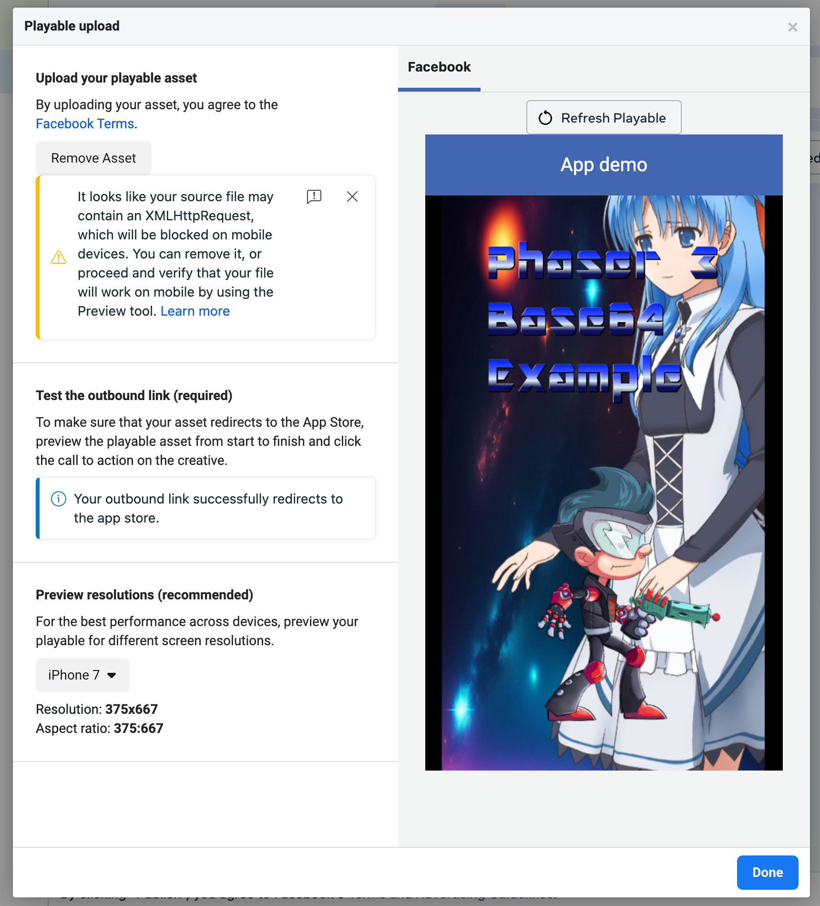

# Meta Playable Ads Phaser 3 Template

**Updated 20th December 2024**

This is a Phaser 3 Template that uses the Phaser Playable Ads Plugin and two custom Vite configs. These templates will create both the inlined html single-file build and the chunked index + asset 5MB zip build, suitable for Meta Playable Ads.

For fully in-lined 2MB ads you can test at https://developers.facebook.com/tools/playable-preview/

For chunked 5MB zips you need to test via the Meta AdManager.



## How to Use

Meta Playable Ads only support base64 encoded media. In order to support this we use a two-step process:

1. All media is encoded into base64 js files.
2. This is then `import`ed into the Preloader, or elsewhere in the Phaser code and depending on the media type, you use one of the provided special-case loaders in order to process it.

## Encoding Media

All of your assets should go in the `public/assets` folder. In this template you'll find we created sub-folders to make this easier to manage, but this isn't a requirement. It will work fine with all files in the `assets` folder too.

To encode them, do `npm run base64`.

This will run our conversion script. The output files will be saved into the `media` folder. This folder is cleared on each run, so don't save work files in there.

The process will also create the file `media/imports.txt`. Open this in VSCode to easily be able to copy and paste the `import` statements. For example, here is what the file looks like in this template:

```
import { relaxingMusicMP3 } from '../../media/audio_relaxing-music.mp3.js';
import { soundFxMP3 } from '../../media/audio_sound_fx.mp3.js';
import { iceicebabyPNG } from '../../media/fonts_iceicebaby.png.js';
import { iceicebabyXML } from '../../media/fonts_iceicebaby.xml.js';
import { calvinPNG } from '../../media/images_calvin.png.js';
import { spaceyJPG } from '../../media/images_spacey.jpg.js';
import { sukasukaPNG } from '../../media/images_sukasuka.png.js';
import { atlas1ATLAS } from '../../media/spine_atlas1.atlas.js';
import { atlas1PNG } from '../../media/spine_atlas1.png.js';
import { demosJSON } from '../../media/spine_demos.json.js';
```

Now the media is encoded to base64 you can load it into Phaser.

## Phaser Preloader

Inside the Phaser Preloader Scene make sure you import the `Base64Manager`:

```js
import { Base64Manager } from '../utils/Base64Manager.js';
```

You should call this as the first thing you do inside the `preload` method:

```js
Base64Manager(this, () => this.base64LoaderComplete());
```

It takes two parameters: The current Scene and the callback to invoke once the loading has finished. In this case, we're calling `this.base64LoaderComplete()`.

Now you've created the manager, you can load assets.

### Loading Images

These can be handled via the normal Phaser loader. So, import the images you want:

```js
import { spaceyJPG } from '../../media/images_spacey.jpg.js';
import { sukasukaPNG } from '../../media/images_sukasuka.png.js';
```

and then load them as usual in the `preload` method:

```js
this.load.image('bg', spaceyJPG);
this.load.image('suka', sukasukaPNG);
```

Note that we're importing the encoded `js` files from the `media` folder. Not the actual assets.

This is all you need to do for images.

### Loading Audio

Import the helper function:

```js
import { LoadBase64Audio } from '../utils/LoadBase64Audio.js';
```

Then import the audio files as created by the encoder:

```js
import { soundFxMP3 } from '../../media/audio_sound_fx.mp3.js';
```

Finally, invoke the function within `preload`:

```js
LoadBase64Audio(this, [
    { key: 'sound_fx', data: soundFxMP3 }
]);
```

The `key` is the normal Phaser audio key that you'll use for playback. The `data` parameter is the imported audio file. The `LoadBase64Audio` function takes an array, so if you have multiple audio files you should pass them all in here. Don't call this function more than once, bundle them together in this array.

### Loading Bitmap Fonts

The approach is the same here. Ensure your Bitmap Font png and xml files have been encoded and saved to the media folder, then import both the `LoadBase64BitmapFont` helper and the font files:

```js
import { LoadBase64BitmapFont } from '../utils/LoadBase64BitmapFont.js';
import { iceicebabyPNG } from '../../media/fonts_iceicebaby.png.js';
import { iceicebabyXML } from '../../media/fonts_iceicebaby.xml.js';
```

Then you can call the function within `preload`:

```js
LoadBase64BitmapFont(this, {
    key: 'font1',
    xml: iceicebabyXML,
    png: iceicebabyPNG
});
```

The parameters are the same as when loading a Bitmap Font normally with Phaser, so please consult the API Documentation for details.

### Loading Spine Files

There are two steps to loading Spine files. The first is ensuring the Spine plugin is added to Phaser.

Look at the `src/main-with-spine.js` file and you'll see two parts for Spine. First, the import:

```js
import * as SpinePlugin from './spine/SpinePlugin';
```

and then the `gameConfig` plugin:

```js
const gameConfig = {
    // other config values removed
    plugins: {
        scene: [
            { key: 'SpinePlugin', plugin: window['SpinePlugin'], mapping: 'spine' }
        ]
    }
};
```

Make sure you add these lines if you want to use Spine.

A special version of the Spine Plugin has been included in the `spine` folder. Please use this. Do not replace it. It supports Spine 4.1 files.

With the Spine plugin installed, you can then ensure the assets are encoded and import them, along with the helper function:

```js
import { LoadBase64SpineFile } from '../utils/LoadBase64SpineFile.js';
import { atlas1ATLAS } from '../../media/spine_atlas1.atlas.js';
import { atlas1PNG } from '../../media/spine_atlas1.png.js';
import { demosJSON } from '../../media/spine_demos.json.js';
```

Spine consists of a JSON file. This contains all of the animation data. It also has one `.atlas` file. This contains all of the texture mapping. It then has one, or more, atlas files (PNGs). All of these are created when you export from Spine. Consult their documentation for details.

With the function and files imported, we can call it in `preload`:

```js
LoadBase64SpineFile(this, {
    key: 'set1',
    json: demosJSON,
    atlas: atlas1ATLAS,
    png: [
        { key: 'atlas1.png', file: atlas1PNG }
    ],
    preMultipliedAlpha: true
});
```

You set the `key` under which this atlas will be loaded (`set1` in this case).

Then pass in the `json` and `atlas` files you imported.

The `png` property contains an _array_ of PNG to filename mappings. In the code above, the original file was called `atlas1.png`. This is the reference that Spine will have saved to the atlas. We use this object to map that key to the actual imported file.

Finally, you can set if the pma is needed or not. Again, consult the Spine docs for details.

This will load everything needed to use Spine in your Playable Ad.

Have a look at the file `src/PreloaderWithSpine.js` for a complete example.

Please think carefully about using Spine - it adds a very large amount to the filesize!

## The Loader Callback

With all of these calls made the only thing left to do is add some code to the loader callback. This is the callback we defined when calling the `Base64Manager`. In this template ours just does this:

```js
base64LoaderComplete ()
{
    adReady();

    this.scene.start('Game');
}
```

In the `Game` Scene all of the assets you've preloaded here can be used exactly how you'd normally use them within Phaser. There's no actual difference now that they are loaded. Look at `Game.js` for a basic example.

## Compressed Versions of Phaser

This template includes 3 versions of Phaser. These are in the `src/phaser` folder. The default one being used by the source code is:

```js
import * as Phaser from './phaser/phaser-3.87.0-core.js';
```

The Core build is Phaser 3.87 without Arcade Physics, Matter Physics or Tilemap support, as these are traditionally not required for Playable Ads. Should you need them, swap it for the included `phaser-3.87.0-full.js` instead by changing the `import` statements in the source files.

Also included is `phaser-3.80.1.js` which is a Phaser Compressor version that has the following removed:

Arcade Physics
Matter Physics
Tilemaps
Gamepad Support
Mesh, Plane, PointLight and Lights Game Objects

This makes is the smallest build of Phaser, should you need to start saving every last byte.

## Testing your Ad

Use `npm run dev` to test the Ad locally. This will launch Vite dev server, so you can use localhost to view the ad.

## Building your Ad

When it comes time to test it on Meta there are two build commands you can use, depending on which ad-type you are creating:

`npm run buildzip` and
`npm run buildinline`

The `buildzip` command will do the following:

1. Create a build with all of the data inlined into the `dist-split` folder. The end result will be a single `index.html` file and then a single JS file that contains everything else.

2. Vite will then zip this for you and save it into a file called `dist.zip` in the `dist-split` folder. This is the file you can upload to the Meta Ads Manager.

If you are creating an inline-ad, use the command `buildinline` instead. The results of this are saved to the `dist-inline` folder. This is not zipped, as there's no need. Meta, and others, expect an html file upload, which is what this creates.

Note that you will still get the warning "It looks like your source file may contain an XMLHttpRequest, which will be blocked on mobile devices. You can remove it, or proceed and verify that your file will work on mobile by using the Preview tool." - you can safely ignore this. Although the call is present inside Phaser, it won't be used.

## Optimization Tips

The downside of Meta requiring everything as base64 is that the files are huge. Your assets will increase in size by a third and there's nothing you can do to stop this. So the trick is to make sure the source media is as tiny as possible up front.

Use JPEG where possible and you don't need transparency. Use 8-bit PNGs that have been palette reduced via a site like https://tinypng.com/ to shave important bytes off. Use audio formats and encodings that optimize space vs. clarity.

There's nothing this template can do to crunch your assets, that needs to become part of your workflow. Good luck! Shaving bytes is a challenge all playable ad devs face. It's an eternal struggle.


To do
1. Heart mask behind heart bg: Done
2. Benches and hand pointer in resize handling: Done
3  Hand movement anti clockwise: Done
4. Lose state handling
5. waldo container rotation and upward sidewards movement
6. Compression and asset resizing (especially video)
7. Ad networks testing
8. Tween benches
9. Add delay before moving to mid card